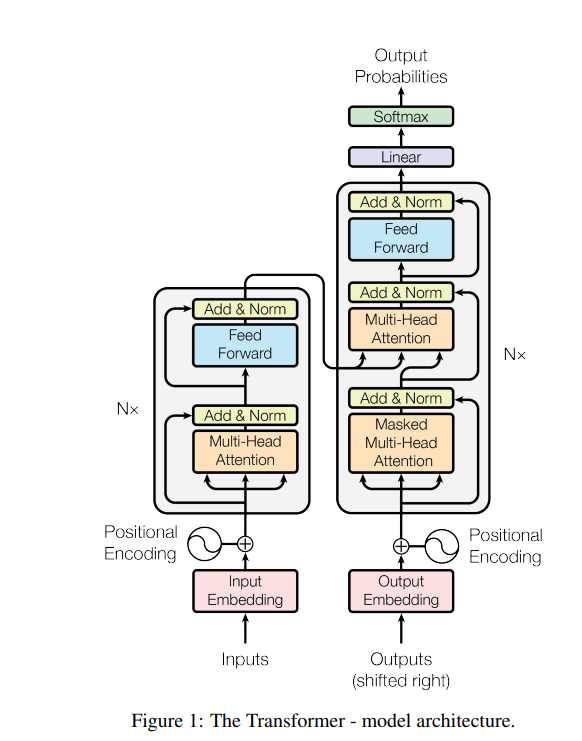
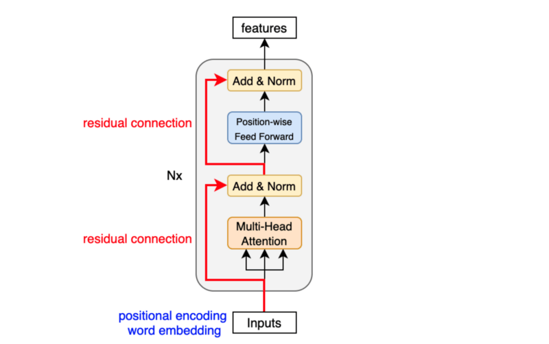

# GPT-2
**Tensorflow vs Pytorch**  
- The original code from the GPT-2 paper is written in tensorflow, we are using pytorch here.
- Here is the huggingface implementation, also using pytorch, but a bit more complicated https://github.com/huggingface/transformers/blob/main/src/transformers/models/gpt2/modeling_gpt2.py

**Model parameters**  
- We are reproducing the 124M parameter model, not the 1.5B one (gpt2-xl)

**Model components**  
- wte: tokens lookup table, we have 50257 tokens and each is of embedding size of 768
- wpe: positions lookup table, we have 1024 positions that each token can be attending to in the past, the position vector embedding is of size 768 as well (this is learned by the optimization)

**Transformer Architecture**
- GPT2 is slightly modified from the original transformer
    - there's no encoder, just the decoder
    - the cross-attention that is using the encoder is also missing

Other changes in the newer Transformer (GPT-2/3 style):

* **LayerNorm position changed**: instead of applying LayerNorm *after* attention/MLP (post-norm), it is applied *before* them (pre-norm).
* **Extra LayerNorm added**: one more normalization step is inserted before the final output/classifier.
* Net effect: normalization happens earlier and more often in the network.

Implication:

* Improves training stability, especially for deeper models.
* Helps gradients flow better compared to the older post-norm design.

The Original Transformer  


The GPT-2/3 Transformer  



## Schematics

### 1) Full model

```text
input token ids (B, T)
        │
        ├── token embedding: wte
        │      (vocab_size, n_embd)
        │
        ├── position embedding: wpe
        │      (block_size, n_embd)
        │
        └── sum
               ↓
        x: (B, T, n_embd)
               │
               ├── Block 1
               ├── Block 2
               ├── ...
               └── Block n_layer
               │
               ↓
        final layer norm: ln_f
               │
               ↓
        lm_head (linear to vocab)
               │
               ↓
        logits: (B, T, vocab_size)
```


### 2) GPT module structure

```text
GPT
├── transformer
│   ├── wte : Embedding(vocab_size, n_embd)
│   ├── wpe : Embedding(block_size, n_embd)
│   ├── h   : [Block × n_layer]
│   └── ln_f: LayerNorm(n_embd)
└── lm_head : Linear(n_embd → vocab_size, bias=False)
```


### 3) One Transformer Block

```text
input x: (B, T, C)
   │
   ├────────────────────────────────────────────┐
   │                                            │
   │    ln_1                                    │
   │     │                                      │
   │     ↓                                      │
   │  CausalSelfAttention                       │
   │     │                                      │
   │     ↓                                      │
   └── + residual ──────────────────────────────┘
                 │
                 ↓
               x'
                 │
   ├────────────────────────────────────────────┐
   │                                            │
   │    ln_2                                    │
   │     │                                      │
   │     ↓                                      │
   │    MLP                                     │
   │     │                                      │
   │     ↓                                      │
   └── + residual ──────────────────────────────┘
                 │
                 ↓
            output: (B, T, C)
```


### 4) Attention internals

```text
input x: (B, T, C)
   │
   └── c_attn: Linear(C → 3C)
          │
          ↓
      qkv: (B, T, 3C)
          │
          ├── split into q, k, v
          │      q: (B, T, C)
          │      k: (B, T, C)
          │      v: (B, T, C)
          │
          ├── reshape into heads
          │      q: (B, nh, T, hs)
          │      k: (B, nh, T, hs)
          │      v: (B, nh, T, hs)
          │      where C = nh * hs
          │
          └── scaled dot-product attention
                 with causal mask
                 ↓
              y: (B, nh, T, hs)
                 │
                 ├── transpose + concat heads
                 │      ↓
                 │   (B, T, C)
                 │
                 └── c_proj: Linear(C → C)
                        ↓
                    output: (B, T, C)
```


### 5) MLP internals

```text
input x: (B, T, C)
   │
   ├── c_fc   : Linear(C → 4C)
   │      ↓
   │   (B, T, 4C)
   │
   ├── GELU
   │      ↓
   │   (B, T, 4C)
   │
   └── c_proj : Linear(4C → C)
          ↓
      output: (B, T, C)
```


### 6) Shape flow for GPT-2 small default config

- `n_layer = 12`
- `n_head = 12`
- `n_embd = 768`
- head size = `768 / 12 = 64`

```text
token ids                    : (B, T)
wte(token ids)               : (B, T, 768)
wpe(position ids)            : (T, 768) or broadcast to (B, T, 768)
sum                          : (B, T, 768)

through each Block:
  ln_1                       : (B, T, 768)
  attention q/k/v            : (B, 12, T, 64)
  attention output           : (B, T, 768)
  residual add               : (B, T, 768)

  ln_2                       : (B, T, 768)
  mlp expand                 : (B, T, 3072)
  mlp project back           : (B, T, 768)
  residual add               : (B, T, 768)

after 12 blocks              : (B, T, 768)
ln_f                         : (B, T, 768)
lm_head                      : (B, T, 50257)
```


### 7) Compact “all-in-one” diagram

```text
token ids
   │
   ├── wte(token embeddings)
   ├── wpe(position embeddings)
   └── add
        ↓
   x: (B, T, 768)
        │
        ├── Block × 12
        │      │
        │      ├── LN
        │      ├── Causal Self-Attention
        │      │      ├── Linear → q,k,v
        │      │      ├── split into 12 heads
        │      │      ├── causal attention
        │      │      └── Linear projection
        │      ├── residual add
        │      ├── LN
        │      ├── MLP
        │      │      ├── Linear 768→3072
        │      │      ├── GELU
        │      │      └── Linear 3072→768
        │      └── residual add
        │
        └── ln_f
             ↓
        lm_head
             ↓
        logits over vocabulary
```


### 8) Minimal interpretation
> `GPT-2 is embeddings + a stack of pre-LN Transformer blocks + final layer norm + vocabulary projection.`

- `wte` maps token ids to vectors.
- `wpe` injects token position.
- Each `Block` is:
  - pre-LN attention + residual
  - pre-LN MLP + residual
- Attention lets each token look only left because `is_causal=True`.
- `lm_head` converts final hidden states into next-token logits.
